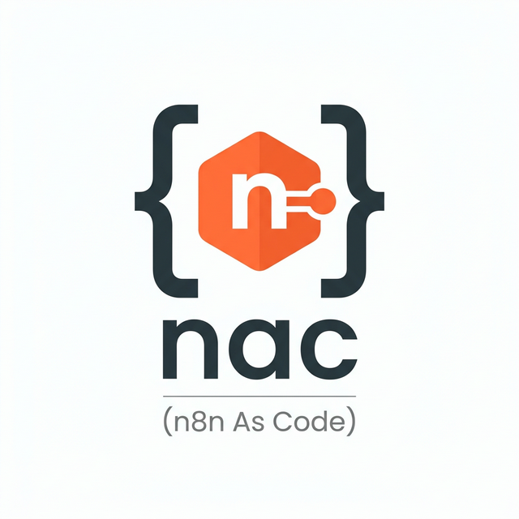

<p align="center">
  
</p>

<h1 align="center">nac - n8n As Code</h1>

<p align="center">
  <strong>The missing GitOps link for n8n.</strong><br />
  Turn workflows and credentials into version-controlled, CI-deployable code with zero runtime dependencies.
</p>

<p align="center">
  <a href="#features">Features</a> •
  <a href="#installation">Installation</a> •
  <a href="#quick-start">Quick Start</a> •
  <a href="#configuration">Configuration</a> •
  <a href="CONTRIBUTING.md">Contributing</a>
</p>

---

`nac` is a CLI tool designed to treat n8n workflows and credentials as first-class citizens in your development lifecycle. It enables a true **GitOps workflow**: develop locally, version in Git, and deploy to production via CI/CD.

## 🚀 Features

*   **Zero Runtime Dependencies**: Written in Go. Connects directly to Postgres. No need for the n8n CLI or Docker on your host for core operations.
*   **Credentials as Code**: Safely export credentials. Secrets are replaced with `ENV:PLACEHOLDER` strings and automatically synchronized with your `.env.local` or remote environment files.
*   **Smart Diffing**: Automatically strips noisy, instance-specific metadata (timestamps, version counters, etc.) so your Git history stays clean.
*   **Automatic Ownership**: Handles n8n 2.x's project ownership model. Imported workflows and credentials are automatically linked to your default project.
*   **Cross-Environment Portability**: Automatically remaps internal `executeWorkflow` node references between environments where database IDs differ.
*   **Mirror Mode**: Keep your remote environment perfectly in sync with your repository by automatically removing items that no longer exist in Git.
*   **Built-in Troubleshooting**: Includes a wrapper around the n8n REST API to list executions and debug nodes directly from your terminal.

## 🛠 Tech Stack

| Component | Technology | Version |
|-----------|------------|---------|
| Language | [Go](https://go.dev/) | 1.24+ |
| CLI Framework | [Cobra](https://github.com/spf13/cobra) | v1.10 |
| Database Driver | [pgx](https://github.com/jackc/pgx) | v5.8 |
| Env Management | [godotenv](https://github.com/joho/godotenv) | v1.5 |
| Testing | [testcontainers-go](https://github.com/testcontainers/testcontainers-go) | v0.40 |

## 📦 Installation

### Homebrew (macOS/Linux)
```bash
brew install crymfox/tap/nac
```

### Manual Installation (Binary)

**Linux (amd64)**
```bash
curl -L https://github.com/crymfox/nac/releases/latest/download/nac_Linux_x86_64.tar.gz | tar xz
chmod +x nac
sudo mv nac /usr/local/bin/
```

**macOS (Apple Silicon)**
```bash
curl -L https://github.com/crymfox/nac/releases/latest/download/nac_Darwin_arm64.tar.gz | tar xz
chmod +x nac
sudo mv nac /usr/local/bin/
```

### Build from source
```bash
git clone https://github.com/crymfox/nac.git
cd nac
make build
./nac version
```

## ⚡ Quick Start

Initialize a new project:

```bash
mkdir my-automation && cd my-automation
nac init
```

This scaffolds:
*   `nac.yaml`: Main configuration and credential type mappings.
*   `docker-compose.yaml`: Ready-to-use local development stack.
*   `.env.local`: Local secrets (includes a generated `N8N_ENCRYPTION_KEY`).
*   `n8n_workflows/` & `n8n_credentials/`: Where your code lives.

Start your local instance:
```bash
nac up
```

Open `http://localhost:5678`, build your workflows, then export them:
```bash
nac export workflows
nac export credentials
```

Commit and push to trigger your CI/CD pipeline!

## ⚙️ Configuration

The `nac.yaml` file allows you to define multiple environments and custom credential mappings.

### Environments
```yaml
environments:
  production:
    db:
      host_env: DB_HOST
      user_env: DB_USER
      password_env: DB_PASS
      ssl: true
    encryption_key_env: N8N_ENCRYPTION_KEY
```

### Custom Credential Types
Define how `nac` should handle your specific credentials:
```yaml
credential_types:
  myCustomApi:
    fields:
      - name: apiKey
        secret: true
        env_suffix: _API_KEY
```

## 🤝 Contributing

We welcome contributions! Please see our [Contributing Guide](CONTRIBUTING.md) for details on how to get started.

## 📄 License

Distributed under the MIT License. See `LICENSE` for more information.

---

<p align="center">Built with ❤️ by Crymfox Labs</p>
